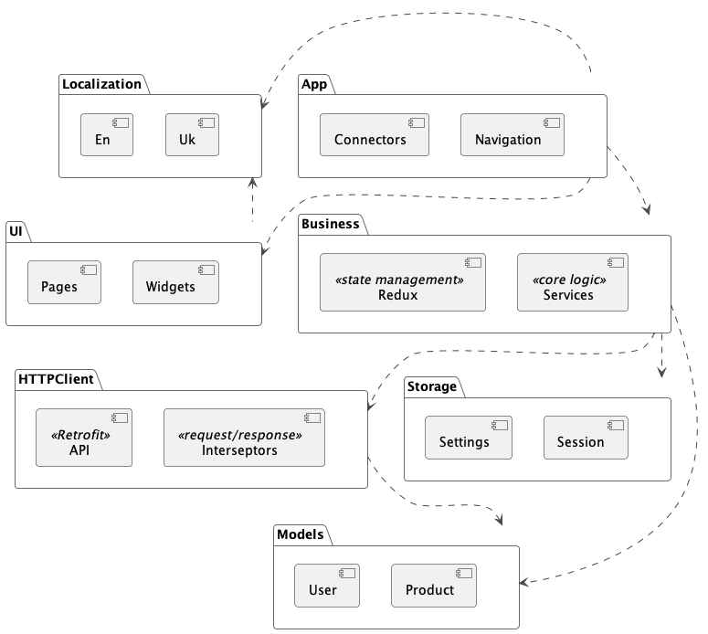

# Progress Pal

An app to track weight loss and workouts for a friendly challenge with a friend. Built with Flutter and PocketBase.

## Project Structure

The project is organized into the following folders to ensure a clean separation of concerns and modular development:

- **`templates`**: Contains code generation templates for creating states, pages, and connectors. Supports VSCode integration for quick scaffolding.
- **`app`**: Handles app-wide configurations such as navigation, connectors, and entry points.
- **`ui`**: Manages the user interface, including pages, widgets, and design-related components.
- **`business`**: Contains the core business logic, including Redux actions, reducers, and state management.
- **`http_client`**: Encapsulates HTTP-related logic, including API clients and network configurations.
- **`models`**: Defines reusable data models shared across the application.
- **`storage`**: Manages local storage solutions, such as caching and persistence layers.
- **`localization`**: Handles multi-language support, translations, and locale-specific logic.
- **`scripts`**: Includes utility scripts for automation, build configurations, and maintenance tasks.
- **`docs`**: Provides project documentation, guidelines, and resources for developers.

## Modules UML

